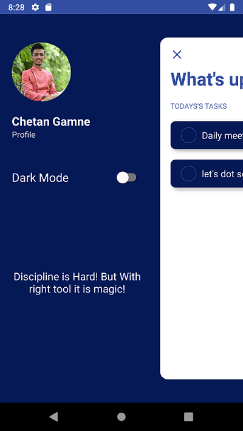
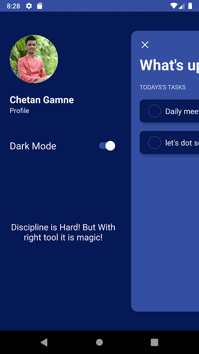
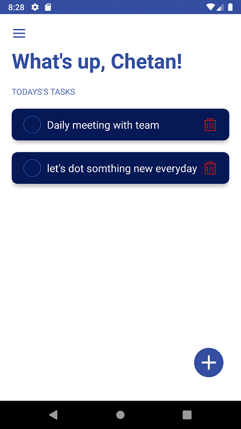
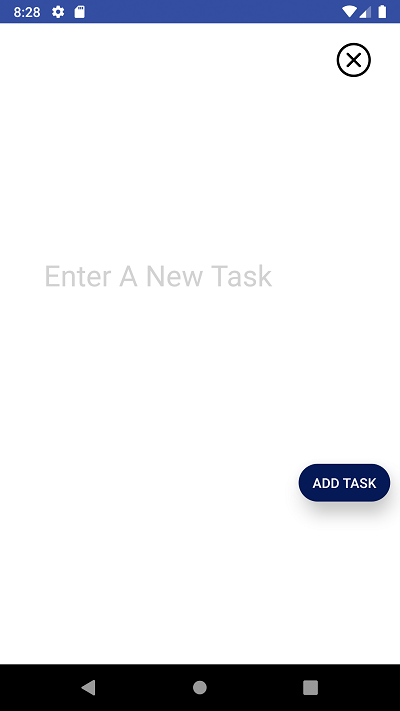
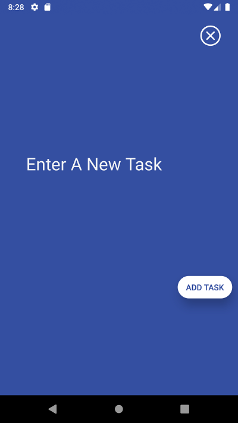

# Todo-React-native-Application-
Todo Application build in react-native
Here Are Some Views Of My Application

    <table>
	    <tr>
    	    <td style="padding:10px">
        	    
      	    </td>
            <td style="padding:10px">
            	
            </td>
            <td style="padding:10px">
            	
            </td>
            <td style="padding:10px">
            	
            </td>
            <td style="padding:10px">
            	
            </td>
            <td style="padding:10px">
            	
            </td>
        </tr>
    </table>

